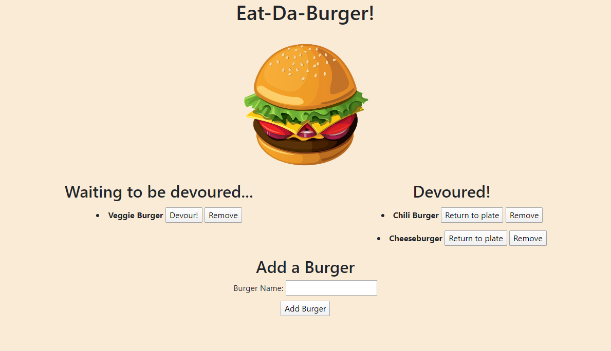

# Eat-Da-Burger

Eat-Da-Burger is a full stack app developed in node.js for adding and devouring your favorite burgers.

## General Info

This application allows you to:
- Add a new burger to your plate by filling out Burger 
- Devour a burger by pressing the "Devour!" button.
- Return the burger back to your plate (eww... gross) by pressing the "Return to plate" button.
- Remove a burger by pressing the "Remove" button.

Deployed Application Link: https://hw13-burger-app.herokuapp.com/

### Languages Used
- JavaScript
- jQuery
- MySQL
- Node.js
- Handlebars
